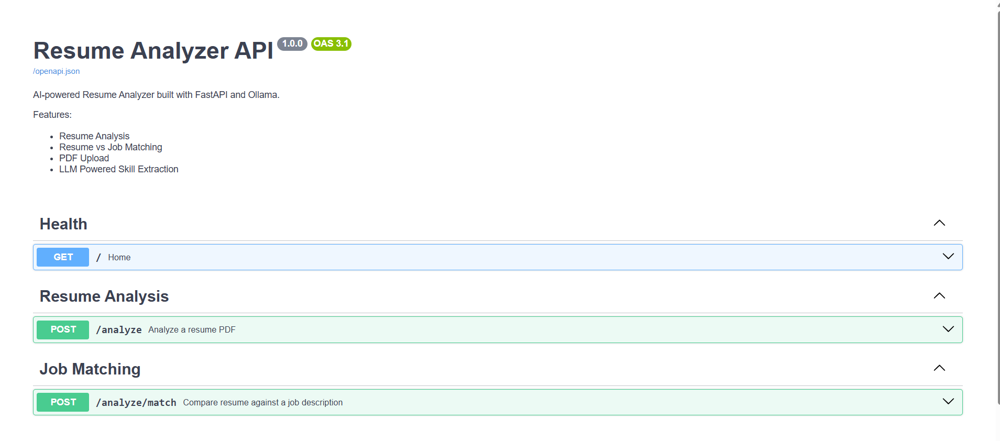
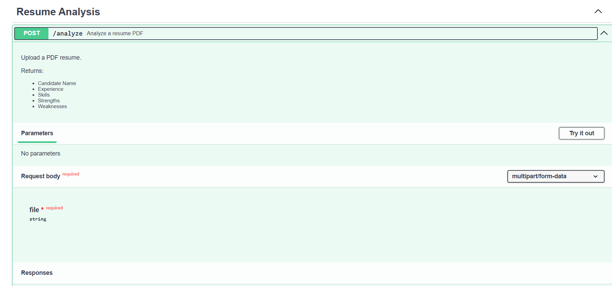

# 📄 Resume Analyzer API

An AI-powered Resume Analyzer built with **FastAPI**, **Ollama**, and **Docker**.

The application extracts structured candidate information from PDF resumes and compares resumes against job descriptions using a locally hosted Large Language Model (LLM).

---

## ✨ Features

- 📄 Analyze PDF resumes
- 🤖 AI-powered resume parsing using Ollama
- 🎯 Resume vs Job Description matching
- 📊 Structured JSON responses
- 🐳 Docker support
- ⚙️ Environment-based configuration
- ✅ Automated testing with Pytest
- 🚀 GitHub Actions CI pipeline
- 📚 Interactive Swagger API documentation

---

## 🛠 Tech Stack

| Category | Technology |
|----------|------------|
| Backend | FastAPI |
| Language | Python 3.12 |
| LLM | Ollama (Llama 3.2) |
| Containerization | Docker |
| Testing | Pytest |
| CI/CD | GitHub Actions |
| Documentation | Swagger / OpenAPI |

---

## 📂 Project Structure

```text
resume-analyzer/
│
├── config/              # Application configuration
├── data/                # Sample resumes
├── exceptions/          # Custom exception handlers
├── models/              # Pydantic response models
├── prompts/             # LLM prompts
├── services/            # Business logic
├── tests/               # Unit tests
├── uploads/             # Temporary uploaded files
├── utils/               # Utility functions
│
├── app.py               # FastAPI application
├── Dockerfile
├── docker-compose.yml
├── requirements.txt
├── README.md
└── .env.example
```

---

## 🏗 Architecture

```text
                Client
                  │
                  ▼
           FastAPI REST API
                  │
          Upload Resume PDF
                  │
                  ▼
        Extract Text from PDF
                  │
                  ▼
       Generate LLM Prompt
                  │
                  ▼
       Ollama (Llama 3.2)
                  │
                  ▼
      Structured JSON Output
                  │
                  ▼
             API Response
```

---

## 🚀 Getting Started

### 1. Clone the repository

```bash
git clone https://github.com/iamanishh/resume-analyzer.git

cd resume-analyzer
```

---

### 2. Create a virtual environment

```bash
python -m venv .venv
```

Activate it

Windows

```bash
.venv\Scripts\activate
```

Linux/macOS

```bash
source .venv/bin/activate
```

---

### 3. Install dependencies

```bash
pip install -r requirements.txt
```

---

### 4. Install Ollama

Download:

https://ollama.com/download

Pull the model

```bash
ollama pull llama3.2:3b
```

Start Ollama

```bash
ollama serve
```

---

### 5. Configure environment

Create a `.env` file

```env
MODEL_NAME=llama3.2:3b
OLLAMA_BASE_URL=http://localhost:11434
```

---

### 6. Run the application

```bash
uvicorn app:app --reload
```

Open

```
http://127.0.0.1:8000/docs
```

---

## 🐳 Running with Docker

Build the image

```bash
docker build -t resume-analyzer .
```

Run the container

```bash
docker run --rm -p 8000:8000 resume-analyzer
```

> **Note:** When running inside Docker on Windows, configure `OLLAMA_BASE_URL` to use:

```text
http://host.docker.internal:11434
```

---

## 📌 API Endpoints

| Method | Endpoint | Description |
|---------|----------|-------------|
| GET | `/` | Health Check |
| POST | `/analyze` | Analyze a Resume |
| POST | `/analyze/match` | Compare Resume Against Job Description |

---

## 📷 Screenshots

### Swagger UI

> Add a screenshot here

---

### Resume Analysis Response

> Add a screenshot here

---

### Resume Matching Response

> Add a screenshot here

---

## 🧪 Running Tests

```bash
pytest
```

---

## 🔄 CI/CD

GitHub Actions automatically

- Installs dependencies
- Runs tests
- Builds the Docker image

on every push to the `main` branch.

---

## 🔮 Future Improvements

- User authentication
- Database integration
- Resume history
- ATS score calculation
- Async processing
- Cloud LLM support
- Batch resume analysis
- Export results to PDF

---

## 👨‍💻 Author

**Manish Kumar**

GitHub:
https://github.com/iamanishh

---

## 📄 License

This project is licensed under the MIT License.